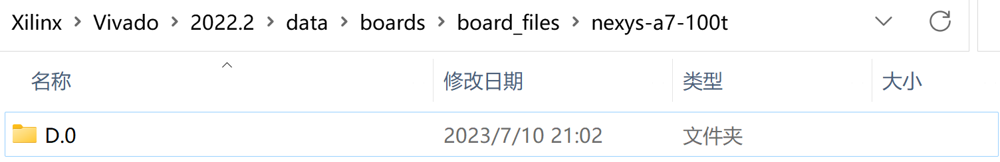
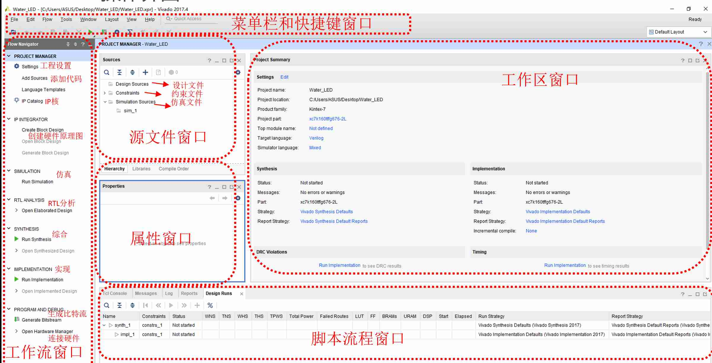
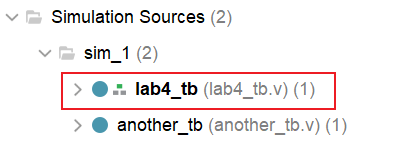
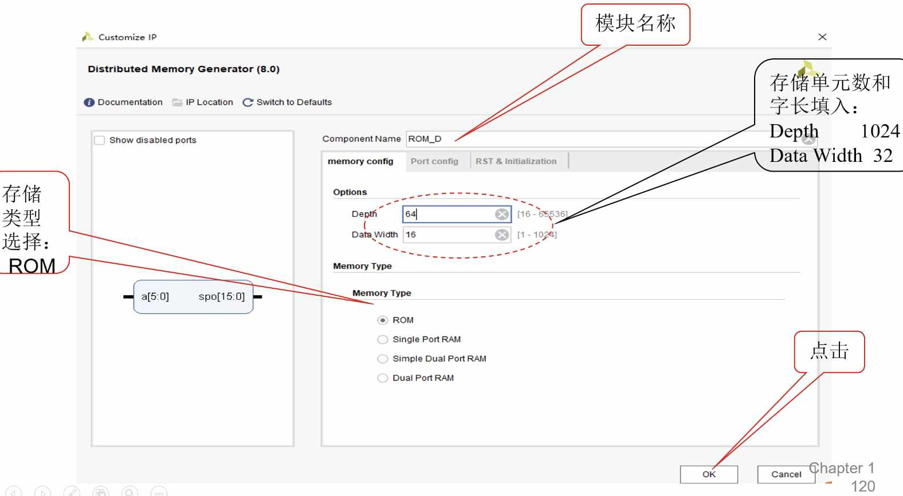

# 使用 Vivado

???+ tips "开始之前"
    * 实验工程的路径不应有中文和空格。
    * 默认掌握了 Verilog 基础并知道如何进行测试。
    * 如果你的数逻课程一路摸鱼，可以参考：[菜鸟Verilog教程](https://www.runoob.com/w3cnote/verilog-tutorial.html)、[HDLBits](https://hdlbits.01xz.net/wiki/Main_Page)、数逻助教的时候摸出来的[slides](https://github.com/Guahao31/for_Computer_Logic/tree/master/slides)。
    * Slides 中所有使用 `bd` 文件（类似于数逻画的原理图）的部分，都改为使用 Verilog 完成，避免 Vivado 的奇怪 bug 影响你的实验。
    * 可以调整最多线程数，加快综合，具体设置可参考[ vivado 多线程编译设置](https://blog.csdn.net/yundanfengqing_nuc/article/details/107866015)（之后的文档中，参考博客我会尽量选择墙内可查看的）。
    * 对于使用 Windows 系统的同学。工程和 IP 文件命名尽量简短干练且位于硬盘根目录等浅层目录。否则后续实验会出现路径超出 Windows 系统支持的最大长度，一旦出现就需要将之前所有的 IP一一打开全部重新生成重新归置。
    * 将整学期实验的所有 IP 核组织到统一的浅目录中，后续所有实验的 IP Catalog 都引用该目录下的 IP。
    * 在修改某些 IP 时，采用右键 IP，选择 `Edit in IP Packager` 进入自动生成的子工程中修改，修改完成后 `Repackage IP`，然后回到父工程中 `Upgrade IP` 即可。可以避免自认为IP更新了，实际上工程并没识别到。
    * 在进行 `Generate Output Product` 时，尽量从头到尾均选择 `Out of Context` 模式。可以便于仿真。
    * Slides 中存在一定的错误，请认真阅读，结合理论课程知识分析，只要理论课认真学习，完全可以辨识和解决。
    * `Tools → Setting` 中可以开启一些设置方便实验。
        - `Source File → File Saving` 中可以开启自动保存源文件，减少弹窗询问是否保存。
        - `Dispaly → Spacing → Density` 调整为 `Compact` 可以在小屏幕上显示更多内容。
        - `Text Editor` 中可以调整编辑器为其他第三方编辑器 如 VS Code。
        - `Text Editor → Fonts and Colors` 可以调整 Fonts family 和 size，原始的太费眼睛了。


⬆️**开始实验之前，请认真阅读以上建议。**

## 使用 Vivado

这一节你将尝试使用 Vivado 完成小项目，体验 Vivado 的工作流程。

这里我们将列出 Vivado 常见的用法，其中部分内容并不需要实际操作，也不用在报告中给出。写出来的目的是用作参考，以便你在实际操作时能够快速找到对应的步骤。**不要求在报告给出的部分可以跳过，之后实验用到时会用即可。**

### 添加板卡文件

从 2023-2024 春夏学期开始，《计算机组成与设计》实验在 [Digilent Nexys A7](https://digilent.com/reference/programmable-logic/nexys-a7/start) 开发板上进行，[参考文档](https://digilent.com/reference/_media/reference/programmable-logic/nexys-a7/nexys-a7_rm.pdf)。

我们需要添加板卡文件，官方[安装板卡参考](https://digilent.com/reference/programmable-logic/guides/installing-vivado-and-vitis#install_digilent_s_board_files)。

请将附件 [nexys-a7-100t.zip](./attachment/nexys-a7-100t.zip) 解压，将文件放置在 Vivado 安装路径 `your_path_to_vivado/<version>/data/boards/board_files` 下，如果 `data` 文件夹中没有 `borads` 请自行新建。

举个例子，若将 2022.2 版本 Vivado 安装在 D 盘符中，应该能在 `D:\Xilinx\Vivado\2022.2\data\boards\board_files\nexys-a7-100t` 路径下，找到解压缩得到的 `D.0` 文件夹。



### Vivado 的基本操作

#### 创建 Vivado 工程

* 启动 Vivado 之后，选择顶部快捷栏中的 `File -> Project -> New`。
* 在 Project Name 界面中修改工程名称及路径，请注意，**路径和名称中不要有中文**，以避免一些问题。
* 在 Project Type 界面，选择 `RTL Project`，子选项保持默认即可（把 `Do not specify at this time` 勾上，表示在新建工程时不去指定源文件）。
* 在 Default Part 界面，进入 `Boards` 并在其中找到并选择 `Nexys A7-100T`。
* 点击 `Finish` 即可完成工程创建。
    * 在创建结束前的总结页，请保证以下内容对应正确：
        * Default Board: Nexys A7-100T（请注意不是 Arty A7-100）
        * Default Part: xc7a100tcsg324-1



#### 添加源文件

* 工程创建后，可以在 `Flow Navigator` 界面（工作流窗口）下点击 `Add Sources`，选择 `Add or create design sources` 添加源文件。

    !!! Info 
        * 选择 `Add or create constrains`，添加约束文件，主要有引脚约束、时序约束和物理约束等。
        * 选择 `Add or create design sources`，添加 Verilog 源文件，用于综合。
        * 选择 `Add or create simulation sources`，添加仿真测试文件，用于仿真。

* 点击 `Next` 后，可以通过新建源文件或者从其他地方导入源文件。
    * `Create File` 创建文件，并选择文件类型为 `Verilog`，输入文件名，文件保存路径选择 `<Local to Project>`，点击 OK。
    * 选择 `Add Files`，在弹出的对话框中找到想要添加的源文件，并点击 `OK`。当前对话框左下角有一个选项是 `Copy sources into project`，可选择是否将源文件复制到工程目录下。本节实验中，是否勾选 `Copy sources into project` 选项对实验过程影响不大。 如果勾选，它会将你添加的文件拷贝到工程目录下 `xxx.srcs/` (`xxx` 是工程名) 对应的目录下。
    * 选择 `Add Directories`，与 `Add Files` 类似，区别在于它会将目录下的所有文件添加到工程中。

* 添加源文件后点击 `Finish`，继续弹出的对话空中，可以设置一些端口，但是我们现在直接单击 `OK`。
* 创建完成后可以在 `Sources -> Design Sources`（源文件窗口）中看到刚刚创建的文件，这个文件就是我们可以编写 verilog 程序的文件。双击后即可显示文件代码，我们可以在里面书写代码。
* 添加用于仿真的代码、添加约束文件的步骤与添加源文件类似，这里不再重复。

#### 仿真

* 点击 `Add Sources`，通过上面的过程添加仿真测试文件。
* 创建完成后在源文件窗口找到 `Simulaion Sources` 下双击刚刚创建的仿真文件，这是一个空文件，我们需要添加代码。
* 在进行仿真前，请检查仿真文件 `Simulation Sources` 中的顶层模块是否选择正确。一个工程中可以有多个仿真文件，但只有一个仿真顶层模块，如果你需要使用其他的仿真文件，可以通过右键点击要设为顶层模块的文件，并选择 `Set as top` 进行切换。
    

* 确认无误后，点击左边工作流窗口栏 `SIMULATION -> Run Simulation`，进行仿真。

!!! Info "仿真的相关按钮"
    

    首先认识一下界面，上栏图中按钮从左到右依次为：

    * **Restart**：清空当前波形，准备进行下次仿真（Windows 下某些版本极易造成闪退）。
    * **Run All**：进行一遍仿真，直到遇到停止信号（如 `$finish()` 或在 GUI 中设置的断点）或某一时间上限。
    * **Run for xxx**：与右侧两栏配合，表示从当前仿真位置开始，继续仿真一段时间（时间由按钮右方的数字和单位决定）。
    * **Step**：笔者并不清楚此功能，推测是多个断点间步进。
    * **Relaunch Simulation**：如果修改了仿真文件或用于综合的代码，需要重新加载。

    

    在波形界面栏中也有几个较为实用的按钮：

    * **Search**：选中波形后，可以根据想要的值（完全匹配、高位匹配或低位匹配）搜索，找到该值所在的位置。
    * **Save Waveform Congfiguration**：如果对波形设置有修改（如添加或删除了信号，修改了信号的数制，信号线颜色等）可以通过保存得到配置文件，方便之后仿真时直接使用修改后的配置文件。
        * 在仿真界面中，通过 `File > Simulation Waveform > Open Configuration` 可以打开之前保存的配置文件，打开后点击 `Relaunch Simulation` 即可生成对应波形。
    
    * **Zoom Fit**：可以将当前缩放自动调整为较合适的大小。
    * 其他按钮的功能可以自行尝试，部分按钮需要先选中信号才能使用，没有特别需要注意的点。除此之外，在波形界面里，可以右键点击波形，选择 `Radix` 来修改数制，选择 `Color` 来修改波形颜色。

### 生成 bitstream 并烧录

**Bitstream** 文件是一种由比特流组成的文件，用于存储和传输数据。在我们的实验中，它用来存储 FPGA 的配置信息，可以通过烧录对 FPGA 进行重新编程。

生成 bitstream 的流程是 `Synthesis -> Implementation -> Generate Bitstream`，均可在左边的工作流窗口中找到。如果你直接点击 `Generate Bitstream`，Vivado 会自动帮你完成前两步。

#### 约束文件

在生成 bitstream 之前，我们需要检查并修改[约束文件](./attachment/nexys-a7-100t-master.xdc)。

引脚约束有两种方式：

* 工具直接约束：先进行综合，综合后打开设计图。点击 `I/O Ports`，在脚本流程窗口找到 `Find Results` 中进行管脚配置。其中 `Package Pin` 对应 FPGA 中的管脚，`I/O Std` 对应电平标准。约束完成后，在左上角的菜单栏和快捷键窗口找到保存按钮并命名，点击 `OK`。
* 脚本约束法：在综合前，点击 `Add Sources` 添加约束文件，之后点击 `Next`，`Finish`。
    * 综合的方法：点击工作流窗口 `SYNTHISIS` 下 `Run Synthesis`，弹出综合对象路径及运行线程数设置窗口，采用默认设置，直接点击 `OK`，综合完成后弹出成功窗口，可以继续进行实现步骤，或者打开综合后的原理图设计以及查看综合报告。
    

一般来说，我们都使用脚本约束法进行引脚约束，下面给出脚本约束文件的例子。

!!! Example 
    以 `I1` 的约束进行举例：
    ``` verilog
    set_property PACKAGE_PIN J15 [get_ports {I0}]
    set_property IOSTANDARD LVCMOS33 [get_ports {I0}]
    ```
    它为端口 `I0` 分配了引脚 `J15`，这是板上最右侧的开关，你可以在 A7 板对应开关上方看到 `J15` 的标记；同时，它规定了引脚的输入/输出标准为 `LVCMOS33`，此处不需要深究，感兴趣的同学可以自行搜索。

    在本次或者后续实验中，我们会给出部分引脚约束文件，你可能需要进行修改。我们规定你只需要修改以下划线 `_` 开头的内容（即 `_SOME_PIN` 以及 `_which_signal`），其他部分的内容请保持不变，之后的实验中也以下划线开头为“需要修改部分”的提示。

    这里给出一个修改的例子，你可以尝试修改下边这个约束，使端口 `I2` 分配到引脚 `M13` 上，输入/输出标准为 `LVCMOS33`。
    ``` verilog
    set_property PACKAGE_PIN _SOME_PIN [get_ports {_which_signal}]
    set_property IOSTANDARD LVCMOS33 [get_ports {_which_signal}]
    ```

#### 生成 bitstream

* 修改约束文件后，你可以点击工作流窗口的 `PROGRAM AND DEBUG > Generate Bitstream` 生成比特流。
* 生成比特流的结果将通过弹窗方式提示，如果生成失败请查看日志文件确定失败的原因。
* 得到 bitstream 后，我们需要将下载器连接到电脑上，点击` PROGRAM AND DEBUG > Open Hardware Manager > Open Target > Auto Connect` 进行识别和连接，成功连接后，点击 `Program Device` 选择 `xc7a100t` 设备，在下载程序界面选择我们刚刚生成的比特流文件，将其下载到板上。这一步可能会出现驱动未安装的问题，请自行尝试解决，如果无法解决问题请及时联系助教。

### IP 核

Vivado 的强大之处在于 IP 模块的可重用性。以上是设计者自己设计包含源文件的流程，接下来介绍使用并创建 IP 核的流程。

注意到在真正的工业流程中，我们需要在仿真通过，确认模块功能准确之后，才进行模块的封装。

这里我们以生成一个 5 位的二选一的多路选择器 `MUX2T1_5` 的 IP 核为例。

#### 含源代码的 IP 核封装

* 在上方菜单栏和快捷键窗口单击 `Tools -> Create and Package New IP -> Next`。
* 选择 `Package your current project`，点击 `Next`，选择 IP 的保存路径，点击 `Next`，点击 `Finish`。
* 随后会出现 `Package IP - MUX2T1_5` 的界面，选择 `Review and Package`,点击 `Package IP`。
* 这样，`MUX2T1_5` 的 IP 模块就封装完成。 

#### 不含源代码的 IP 核封装

* 网表文件 `.edf` 的生成。
    * 工程的创建，源文件添加，步骤与上述相同。
    * 在工作流窗口中找到 `Settings` 打开设置后找到 `Synthesis` 选项并点击，在 `Options` 部分划到最下面，在 `More Options` 一栏输入 `-mode out_of_context` 属性，表示在该级不插入任何 I/O BUFFERs。设置后，点击 `OK`。
    * 随后在工作流窗口点击 `Run Synthesis` 开始综合。
    * 综合结束后弹出 `Synthesis Completed` 的对话框，在该对话框中，选择 `Open Synthesized Design` 前面的复选框并点击 `OK`。
    * 在 Vivado 当前设计界面底部的 `Tcl Console` 窗口中依次输入下面的命令：
        * `write_verilog -mode synth_stub E:/FPGA/ip/MUX2T1_5.v `导出空端口文件。
        * `write_edif E:/FPGA/ip/MUX2T1_5.edf` 将 `MUX2T1_T.edf` 文件写到选择的目录下。（目录按实际需求即可）若当前源文件里 含有 Xilinx IP 则需通过如下命令生成 `.edf` 文件：`write_edif -security_mode all E:/FPGA/ip/MUX2T1_5.edf`。
    
* 根据 `.edf` 文件进行 IP 封装。
    * 工程的创建，步骤与上述相同。
    * 在添加源文件时，单击 `Add Files` 按钮，弹出 `Add Source Files` 对话框。在该对话框中，找到 `MUX2T1_5.edf`，`MUX2T1_5.v` 文件。并勾选 `Copy sources into project`，点击 `finish` 直接结束。
    * 接下来的封装步骤与之前类似，在 Vivado 当前工程主界面的主菜单下，执行菜单命令 `Tools -> Createand IP Package...`，请参考带源文件的方法。封装完成，可在对应目录下查看结果文件。  
    
### 存储器 ROM、RAM

ROM、RAM 是 FPGA 中常见的存储器，我们可以通过 IP 核生成这两种存储器。

#### ROM

下面我们以用 IP 核生成一个 1024$\times$32bit 的 ROM 核为例。

* 在工作流窗口选择 `IP Catalog`，将在工作区弹出 `IP Catalog` 的窗口。
* 点击搜索栏，输入 `memory generator`，选择 `Distributed Memory Generator`（异步访问） 或 `Block Memory Generator`（同步访问）。
* 双击 `Distributed Memory Generator` 弹出窗口第 1 页，进行核参数设置：
    

    我们填入存储单元数 1024 和字长 32，存储类型选择 ROM（不要点击 `OK`）。

* 点击 `RST & Initialization`，点击 `Browse...` 选择初始化关联文件（`ROM.coe`），其余选项不用修改，随后点击 `OK` 即可生成 IP 核。
* 生成后调用：核生成后在源文件窗口出现 `ROM_D.xci` 模块。我们可以直接在 verilog 代码里实例化这个模块，例子如下：
    ``` verilog
    ROM_B your_instance_name (
    .a(a), 		// input [9 : 0] a
    .spo(spo) 	// output [31 : 0] spo
    );
    ```

#### RAM

RAM 的生成与 ROM 类似，区别如下：

* `memory generator` 只能选择 `Block Memory Generator`（有时钟）。
* 核参数设置时，在 `Basic` 栏下面的 `Memory Type` 里，下拉选择 `Single Port RAM`；在 `Port A Option` 设置 `Write Width` 和 `Read Width` 为 32，`Write Depth` 和 `Read Depth` 为 1024。`Enable Port Type` 选择 `Always Enabled`；`Port A Optional Output Registers` 处不要勾选 `Primitive Output Register`（若勾选，输出会慢一个周期）。
* 生成成功后即可实例化这个模块，例子如下：
    ``` verilog
    RAM U3 (
      .clka(clk_m), 	  // input clka
      .wea(data_ram_we),  // input [0 : 0] wea
      .addra(ram_addr),      // input [9 : 0] addra
      .dina(ram_data_in),   // input [31:0] dina
      .douta(ram_data_out)// output [31:0] douta
       );
    ```
