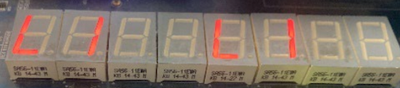

# Lab4-4

<!-- !!! danger "本实验并未 release，内容随时都会变化。个人水平有限，如您发现文档中的疏漏欢迎 Issue！" -->

## 前置知识

### Exception and Interruption

在 [Volume I: RISC-V Unprivileged ISA V20191213](./attachment/riscv-spec-20191213.pdf) 第 1.6 节，有对 exception 和 interruption 的解释：

> We use the term ***exception*** to refer to an unusual condition occurring at run time **associated with
an instruction** in the current RISC-V hart. We use the term ***interrupt*** to refer to an **external
asynchronous event** that may cause a RISC-V hart to experience an unexpected transfer of control.
We use the term ***trap*** to refer to **the transfer** of control to a trap handler caused by either an
exception or an interrupt.

为了方便文档描述，下文中我们用“中断”指代 *interruption*，用“异常”指代 *exception*，用 *trap* 表示中断与异常。

### Control and Status Registers(CSRs)

在 32 个通用寄存器之外（即 `x0 - x31`），还有若干*控制状态寄存器*(Control and Status Register, CSR)。在我们的实验中，CPU 始终运行在 Machine Mode 下，在本实验中我们只需要关注 Machine Mode 下的部分 CSR。

对于每个 CSR 的详细介绍，请查看 [Volume II: RISC-V Privileged Architectures V20211203](./attachment/riscv-privileged-20211203.pdf)，这里仅对我们本次实验需要用到的 CSRs 进行简介：


* **mstatus**： Machine Status Register，存储当前控制状态。
    * 
    * 本次实验中你可以做相对简化，只要可以保证在中断处理过程中不会触发新的中断即可。
* **mtvec**： Machine Trap-Vector Base-Address Register，存储中断向量表基地址。
    * 
    * 低两位记录跳转模式，`0` 为 Direct 模式，即所有 trap 都先进入 `BASE`；`1` 为 Vectored 模式，将进入 `BASE + 4*cause`。高位记录的是 `BASE` 的值（请注意对齐，`BASE << 2` 才是真正要跳转的地址）。
    * 本次实验中，要求使用 Vectored 模式，因为我们并没有要求实现 `csrr` 等指令。
* **mcause**： Machine Cause Register，存储引起这次 trap 的原因。
    * 
    * 如果进入 trap 的原因是中断，则最高位 interrupt bit 设置为 1。
    * 本次实验允许你自由的设计 Exception Code 的含义，在实验报告中说明即可。
* **mtval**： Machine Trap Value Register，存储异常的相关信息以帮助软件处理异常，曾称 mbadaddr。
    * 
    * 在本次实验中没有用到，可以不进行实现，除非你希望完成存储器访问异常（本节实验的 **bonus** 内容）。
* **mepc**： Machine Exception Program Counter，存储 trap 触发时将要执行的指令地址，在 `mret` 时作为返回地址。
    * 
    * 本次实验不涉及 PC 非对齐异常，因此不需要考虑将跳转指令的目标地址送入 `mepc` 的情况。
    * 需要注意的是，在一般的实现中，你需要在 trap 处理程序中检查 `mcause` 寄存器，如果是异常则更新 `mepc <- mepc + 4`，这部分不是你的硬件实现，而是由软件（你的 trap 处理程序）进行管理的。**但是**，本次实验并不要求实现 `csrw` 等指令，因此我们要在 `RV_INT` 模块中直接管理 `mepc`，即触发 trap 时直接根据触发信号（是不是 `INT`）来决定 `mepc <- pc` 还是 `mepc <- pc+4`。

### trap

进入 trap 时，硬件需要负责修改若干 CSR 并将 PC 调整为 trap 处理程序的第一条指令位置（保存在 `mtvec` 中）。

* 更新 `mcause`，记录当前是不是中断，并记录 exception-code。
* 更新 `mstatus`，防止在 trap 处理时又触发中断。
* 更新 `mepc`，记录当前指令的地址。再次提醒，本实验中硬件 `RV_INT` 模块将直接管理 `mepc` 是否自增，如果触发的原因是中断，则 `mepc <- pc`，否则 `mepc <- pc+4`。

为了简化实验，在进入 trap 后，你不需要保存当前现场（寄存器值等），只需要使用验收代码中没有用到的寄存器即可。

## 实验要求

本实验需要修改硬件（添加 `RV_INT` 模块，修改 Datapath）以及软件（修改验收代码，实现 trap 处理）。

修改 `SCPU_ctrl` 模块用来检查 `ecall` 指令和非法指令，并给出相应信号接入 `Datapath` 中。

添加 `VGA` 模块的 debug 信号，至少需要 `mstatus, mcause, mepc, mtvec` 的值。

你需要设计实现三种 trap：外部中断、 `ecall` 指令和非法指令。

* 外部中断，升起 `INT` 信号，你可以设置某个开关来引起外部中断。引起外部中断时，你需要在七段管上打印出以下图形：
    * 
* `ecall` 指令，因为我们并没有实现特权架构，这里 `ecall` 指令仅用来作为触发相应中断的信号。当进行 `ecall` 时，你需要在七段管上打印出以下图形：
    * 
* 非法指令，如果将要执行的指令是非法的，则触发非法指令异常。你需要在七段管上打印出以下图形：
    * 

如何在图形模式下打印将在*软件实现*一节说明。

## 模块实现

中断处理主要是改变了**指令流**，由正常的指令运行切换到 trap 处理程序的执行，最终回到正常的指令流中继续执行。为此，我们需要设计一个模块，用来接收控制信号或外部信号，判断下一条要执行的指令是正常指令流运行还是 trap 处理的指令；同时，还需要修改 Datapath 以支持 PC 来源的改变。

```verilog title="RV_INT.v" linenums="1"
module RV_INT(
  input       clk,
  input       rst,
  input       INT,          // 外部中断信号
  input       ecall,        // ECALL 指令
  input       mret,         // MRET 指令
  input       illegal_inst, // 非法指令信号
  input [31:0] pc_next,     // 正常指令流
  output[31:0] pc           // 将执行的指令 PC 值
);
```

这一模块中，你需要保存并管理 `mstatus, mtvec, mcause, mtval, mepc` 等 CSRs。实现模块时，需要时刻注意：

* `mtvec` 的值要与你所写代码中 trap 处理程序首条指令位置相同，如果你改变了代码，需要检查是不是需要修改 `mtvec` 的值。
* 如果正在进行 trap 处理程序（还未执行 `mret`），不接受其他 trap。
* 根据不同的中断信号，对 CSRs 进行修改，再次提醒，我们的简单实现中，需要硬件对 `mepc` 的具体取值进行管理。
* 请注意设置 CSRs 的初始值，并注意 `rst` 时恢复初始值。

## 软件实现

你需要修改 Lab4-3 提供的验收代码，实现 trap 处理程序以及三种对应的处理程序。

### trap 处理程序

一个简单的方式是放置若跳转指令，在 trap 处理程序中跳至相应中断/异常的处理程序中。如果你使用 Vectored 模式，并将三种 trap 的 exception code 分别设置为 `1, 2, 3`，你的代码应该类似于：

```
# mtvec.BASE = 0x0
# mtvec.MODE = 1(Vecotored mode)
jal x0, main          # PC = 0x0, 正常程序的入口
jal x0, ill_trap      # PC = 0x4, 进入非法指令处理程序
jal x0, ecall_trap    # PC = 0x8, 进入 ecall 处理程序
jal x0, int_trap      # PC = 0xC, 进入外部中断处理程序
```

### 图形模式下的打印

目前提供的七段数码管 IP 核仅能支持打印一半的图形（4个），另一半是拷贝。

输入的 `Disp_num` 到打印图形的映射如下：

```verilog title="SSeg_map"
module SSeg_map(
  input[31:0]Disp_num, 
  output[63:0]Seg_map
);

   assign Seg_map = {
      Disp_num[0],  Disp_num[4], Disp_num[16], Disp_num[25], 
      Disp_num[17], Disp_num[5], Disp_num[12], Disp_num[24],
      Disp_num[1],  Disp_num[6], Disp_num[18], Disp_num[27], 
      Disp_num[19], Disp_num[7], Disp_num[13], Disp_num[26], 
      Disp_num[2],  Disp_num[8], Disp_num[20], Disp_num[29], 
      Disp_num[21], Disp_num[9], Disp_num[14], Disp_num[28], 
      Disp_num[3],  Disp_num[10],Disp_num[22], Disp_num[31], 
      Disp_num[23], Disp_num[11],Disp_num[15], Disp_num[30],
      
      // Copied right part
      Disp_num[0],  Disp_num[4], Disp_num[16], Disp_num[25], 
      Disp_num[17], Disp_num[5], Disp_num[12], Disp_num[24], 
      Disp_num[1],  Disp_num[6], Disp_num[18], Disp_num[27], 
      Disp_num[19], Disp_num[7], Disp_num[13], Disp_num[26], 
      Disp_num[2],  Disp_num[8], Disp_num[20], Disp_num[29], 
      Disp_num[21], Disp_num[9], Disp_num[14], Disp_num[28], 
      Disp_num[3],  Disp_num[10],Disp_num[22], Disp_num[31], 
      Disp_num[23], Disp_num[11],Disp_num[15], Disp_num[30],        
      };
	
   
endmodule
```

其中 `Disp_num` 为我们需要提供的 32-bit 值，`Seg_map` 是最终打印出来的图形，`0` 为亮。现在我们可以设计出来希望打印的图形，因此需要通过这个图形的逆映射得到输入给 `Sseg7` 的 `Disp_num` 值。

举个例子，我们希望在从左往右数第三个数码管上绘制一个矩形，可以很容易得到 `Seg_map` 的值应该为 `0xFFFF39FF`，它只会点亮第三个数码管的 `a, b, f, g`，即一个小矩形。通过逆映射，我们得到 `Disp_num` 值为 `0xFFFFBCFB`。另一个例子，打印第二位上的小矩形 `Seg_map: 0xFF39FFFF ---> Disp_num: 0xFFFFDF3D`。

这一步中，你需要得到希望打印三种 trap 的图形的 `Disp_num` 值。你需要查看验收代码，学习如何将这个值送入七段数码管最终显示一个图形。

请注意，在每个处理程序的末尾，你需要一个 `mret` 指令告知 `RV_INT` 模块中断处理已经结束，需要恢复正常的指令流并对必要的 CSR 进行修改。

## 必要的检查

在完成以上所有步骤后，请检查：

* `RV_INT` 模块中的 `mtvec.BASE` 是否指向了 trap 处理程序的首个指令。
* 我们需要实现 Vectored 模式，`RV_INT` 模块中 `mtvec.BASE + 4*cause` 是否能跳到正确的处理程序。
* 请确保你在某个模式的处理下放置了 `ecall` 指令；在某个模式的处理下放置了一条非法指令。
* Venus 平台无法为你解析 `mret`，请自行书写，并注意 trap 中断处理程序的结尾一定要有 `mret`。
    * 为了不修改 trap 处理程序的跳转指令，你可以在原本 `mret` 的地方写一条 NOP 语句 `add x0, x0, x0` 来占一条指令的位置，在之后将它替换为 `mret`。
* 查看原验收代码的 `148, 149` 行，确保这里的 `jalr` 能够跳转到 `loop2`。
    * 请修改 `0x150, 0x24` 到合适的值，而不要修改其他部分。
*  查看原验收代码的 `auipc` 指令，可能需要改动避免进入 dummy。


## Lab4 思考题

这么重要的实验怎么能没有

!!! question "思考题(呢？)"
    * 在涉及到一个大立即数的读入时，我们经常能想到使用 `lui & addi` 来实现，比如下面这段代码就将 `0x22223333` 赋给了 `t0`:
    ```
    lui t0, 0x22223
    addi t0, t0, 0x333
    ```
    你是否能通过以下代码得到 `0xDEADBEEF`？如果你觉得不能的话，先解释为什么不能，再修改代码中的**一个字符**，使得以下代码有效地得到 `0xDEADBEEF`。（如果你觉得可以的话，请重新学习 [RISC-V ISA](./attachment/riscv-spec-20191213.pdf)）
    ```
    lui t1, 0xDEADB
    addi t1, t1, 0xEEF
    ```
    btw, 如果你把上边代码放到 Venus 上，会发现它给了你一个报错，不要理会它，它理解错了。
    * 之前我们一直在说，如果 trap 的诱因是 `Exception` 则需要 `mepc <- PC+4`，如果是 `Interruption` 则需要 `mepc <- PC`。这是为什么呢？或者说，如果 `Exception` 时进行 `mepc <- PC`，`Interruption` 时 `mepc <- PC+4` 会有什么不幸的后果？