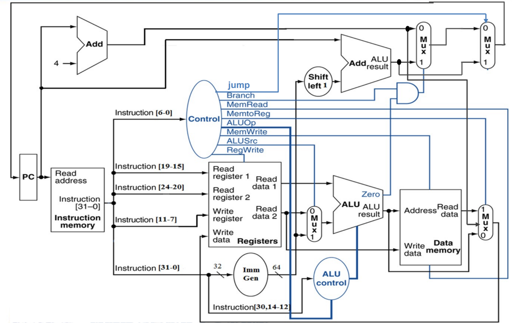

# 指令拓展

<!-- !!! danger "本实验并未 release，内容随时都会变化。个人水平有限，如您发现文档中的疏漏欢迎 Issue！" -->

!!! warning "在开始本实验之前，请备份 Lab4-1 与 Lab4-2 的所有工程，包括你使用的 IP Core。"

## 模块实现

在之前的实验中，我们完成了基本的指令，本节实验要在 Lab4-1 & Lab4-2 的基础之上拓展指令。

!!! tip "在本节实验中，你需要实现以下指令："

    * R-Type: add, sub, and, or, xor, slt, srl, **sll**, **sra**, **sltu**
    * I-Type: addi, andi, ori, xori, srli, slti, **slli**, **srai**, **sltiu**, **lb**, **lh**, lw, **lbu**, **lhu**, **jalr**
    * S-Type: **sb**, **sh**, sw
    * B-Type: beq, **bne**, **blt**, **bge**, **bltu**, **bgeu**
    * J-Type: jal
    * **U-Type**: **lui**, **auipc**

    即 [RISC-V 32I](../Other/RISC_V.md) 中除了 `ecall, ebreak` 外的所有指令，黑体标出的指令为新添加的指令。在开始实验之前，请保证你理解了所有的指令含义与类型。

你可以在 [venus](http://venus.cs61c.org/) 上使用以下代码来理解 `sb, sh` 的含义：

=== "sh"

    ```
    addi x11, x0, 0x421
    lui x10, 0x33333
    addi x10, x10, 0x333
    sw x10, 48(zero)
    sh x11, 49(zero)
    add zero, zero, zero
    ```
=== "sb"

    ```
    addi x11, x0, 0x22
    addi x10, x0, 0x20
    lui x9, 0x33333
    addi x9, x9, 0x333
    sw x9,48(zero)
    sb x11, 49(zero)
    sb x10, 50(zero)
    add zero, zero, zero
    ```

**验收时，你需要提供自己绘制的 CPU datapath 图**。（笔者建议在开始本次实验之前就开始绘制，以便更好地理解流水线 CPU 的数据流）你可以参考理论课 PPT 的 datapath 或者其他人的图，但每个人的实现不尽相同，**请务必动手绘制属于自己的 datapath**。这里以理论课 PPT 的 datapath 为例：
<center>    
{ width="500"}
</center>

你可以使用纸笔绘制（不推荐）但请保证验收时提供一张线条清晰较少涂改的原理图，也可以使用 Microsoft 的 Visio 或 PowerPoint、在线平台如 ProcessOn、 drawio 或平板软件如 Goodnotes、Notability 绘制。

!!! tip
    * 如果你是基于 Lab4-2 的基础进行实验，你可能需要将 SCPU_ctrl 中输出的控制信号进行修改（如增加位宽、指示当前指令是否为无符号，当前指令是否按字节、半字、字访问），以支持更多的指令，同理 ImmGen 生成立即数的方式可能也需要增加。
    * 为了支持 sb、sh 等按字节寻址的指令，你可能需要修改你的存储器 IP 核。对于 RAM 核，需要勾选 Byte Write Enable。同时将 Write Width 改为 32，这样 RAM 的 wea 就会变为 4 位，每一位代表一个字节的写使能。
    * 在生成 RAM 核时，我们需要取消勾选 Primitives Output Register, 否则每次读取数据需要两个周期的时间，而取消勾选后每次读取数据则只需要一周期的时间。
    * 修改 IMem.coe 或 DMem.coe 内容后，需要重新生成对应的存储器 IP 核。

## 波形仿真

SCPU 的仿真与上一节类似，请修改上一节提供的 testbench，使之能够对指令扩展后的 SCPU 进行仿真验证。你可能需要将之前的 `wea` 信号从 1 位扩展为 4 位或 3 位 以支持扩展指令中的 `unsigned, byte, half-word` 的要求。

同时，你需要自行编写一段简单的代码对所有指令进行测试。

## 下板验证

验收时，你需要使用以下验收代码。（验收代码为上上届助教 [@NonoHh](https://github.com/NonoHh) 所写）

??? tip "验收代码"
    === "test_4_3.s" 

        ``` linenums="1" 
            auipc x1, 0
            j     start            # 00
        dummy:
            nop                    # 04
            nop                    # 08
            nop                    # 0C
            nop                    # 10
            nop                    # 14
            nop                    # 18
            nop                    # 1C
            j     dummy

        start:
            bnez  x1, dummy
            beq   x0, x0, pass_0
            li    x31, 0
            auipc x30, 0
            j     dummy
        pass_0:
            li    x31, 1
            bne   x0, x0, dummy
            bltu  x0, x0, dummy
            li    x1, -1           # x1=FFFFFFFF
            xori  x3, x1, 1        # x3=FFFFFFFE
            add   x3, x3, x3       # x3=FFFFFFFC
            add   x3, x3, x3       # x3=FFFFFFF8
            add   x3, x3, x3       # x3=FFFFFFF0
            add   x3, x3, x3       # x3=FFFFFFE0
            add   x3, x3, x3       # x3=FFFFFFC0
            add   x3, x3, x3       # x3=FFFFFF80
            add   x3, x3, x3       # x3=FFFFFF00
            add   x3, x3, x3       # x3=FFFFFE00
            add   x3, x3, x3       # x3=FFFFFC00
            add   x3, x3, x3       # x3=FFFFF800
            add   x3, x3, x3       # x3=FFFFF000
            add   x3, x3, x3       # x3=FFFFE000
            add   x3, x3, x3       # x3=FFFFC000
            add   x3, x3, x3       # x3=FFFF8000
            add   x3, x3, x3       # x3=FFFF0000
            add   x3, x3, x3       # x3=FFFE0000
            add   x3, x3, x3       # x3=FFFC0000
            add   x3, x3, x3       # x3=FFF80000
            add   x3, x3, x3       # x3=FFF00000
            add   x3, x3, x3       # x3=FFE00000
            add   x3, x3, x3       # x3=FFC00000
            add   x3, x3, x3       # x3=FF800000
            add   x3, x3, x3       # x3=FF000000
            add   x3, x3, x3       # x3=FE000000
            add   x3, x3, x3       # x3=FC000000
            add   x5, x3, x3       # x5=F8000000
            add   x3, x5, x5       # x3=F0000000
            add   x4, x3, x3       # x4=E0000000
            add   x6, x4, x4       # x6=C0000000
            add   x7, x6, x6       # x7=80000000
            ori   x8, zero, 1      # x8=00000001
            ori   x28, zero, 31
            srl   x29, x7, x28     # x29=00000001
            auipc x30, 0
            bne   x8, x29, dummy
            auipc x30, 0
            blt   x8, x7, dummy
            sra   x29, x7, x28     # x29=FFFFFFFF
            and   x29, x29, x3     # x29=x3=F0000000
            auipc x30, 0
            bne   x3, x29, dummy
            mv    x29, x8          # x29=x8=00000001
            bltu  x29, x7, pass_1  # unsigned 00000001 < 80000000
            auipc x30, 0
            j     dummy

        pass_1:
            nop
            li    x31, 2
            sub   x3, x6, x7       # x3=40000000
            sub   x4, x7, x3       # x4=40000000
            slti  x9, x0, 1        # x9=00000001
            slt   x10, x3, x4
            slt   x10, x4, x3      # x10=00000000
            auipc x30, 0
            beq   x9, x10, dummy   # branch when x3 != x4
            srli  x29, x3, 30      # x29=00000001
            beq   x29, x9, pass_2
            auipc x30, 0
            j     dummy

        pass_2:
            nop
        # Test set-less-than
            li    x31, 3
            slti  x10, x1, 3       # x10=00000001
            slt   x11, x5, x1      # signed(0xF8000000) < -1
                                # x11=00000001
            slt   x12, x1, x3      # x12=00000001
            andi  x10, x10, 0xff
            and   x10, x10, x11
            and   x10, x10, x12    # x10=00000001
            auipc x30, 0
            beqz  x10, dummy
            sltu  x10, x1, x8      # unsigned FFFFFFFF < 00000001 ?
            auipc x30, 0
            bnez  x10, dummy
            sltu  x10, x8, x3      # unsigned 00000001 < F0000000 ?
            auipc x30, 0
            beqz  x10, dummy
            sltiu x10, x1, 3
            auipc x30, 0
            bnez  x10, dummy
            li    x11, 1
            bne   x10, x11, pass_3
            auipc x30, 0
            j     dummy

        pass_3:
            nop
            li    x31, 4
            or    x11, x7, x3      # x11=C0000000
            beq   x11, x6, pass_4
            auipc x30, 0
            j     dummy

        pass_4:
            nop
            li    x31, 5
            li    x18, 0x20        # base addr=00000020
        ### uncomment instr. below when simulating on venus
            # lui   x18, 0x10000     # base addr=10000000
            sw    x5, 0(x18)       # mem[0x20]=F8000000
            sw    x4, 4(x18)       # mem[0x24]=E0000000
            lw    x27, 0(x18)      # x27=mem[0x20]=F8000000
            xor   x27, x27, x5     # x27=00000000
            sw    x6, 0(x18)       # mem[0x20]=C0000000
            lw    x28, 0(x18)      # x28=mem[0x20]=C0000000
            xor   x27, x6, x28     # x27=C0000000
            auipc x30, 0
            bnez  x20, dummy
            lui   x20, 0xA0000     # x20=A0000000
            sw    x20, 8(x18)      # mem[0x28]=A0000000
            lui   x27, 0xFEDCB     # x27=FEDCB000
            srai  x27, x27, 12     # x27=FFFFEDCB
            li    x28, 8
            sll   x27, x27, x28    # x27=FFEDCB00
            ori   x27, x27, 0xff   # x27=FFEDCBFF
            lb    x29, 11(x18)     # x29=FFFFFFA0, little-endian, signed-ext
            and   x27, x27, x29    # x27=FFEDCBA0
            sw    x27, 8(x18)      # mem[0x28]=FFEDCBA0
            lhu   x27, 8(x18)      # x27=0000CBA0
            lui   x20, 0xFFFF0     # x20=FFFF0000
            and   x20, x20, x27    # x20=00000000
            auipc x30, 0
            bnez  x20, dummy       # check unsigned-ext
            li    x31, 6
            lbu   x28, 10(x18)     # x28=000000ED
            lbu   x29, 11(x18)     # x29=000000FF
            slli  x29, x29, 8      # x29=0000FF00
            or    x29, x29, x28    # x29=0000FFED
            slli  x29, x29, 16
            or    x29, x27, x29    # x29=FFEDCBA0
            lw    x28, 8(x18)      # x28=FFEDCBA0
            auipc x30, 0
            bne   x28, x29, dummy
            sw    x0, 0(x18)       # mem[0x20]=00000000
            sh    x27, 0(x18)      # mem[0x20]=0000CBA0
            li    x28, 0xD0
            sb    x28, 2(x18)      # mem[0x20]=00D0CBA0
            lw    x28, 0(x18)      # x28=00D0CBA0
            li    x29, 0x00D0CBA0
            auipc x30, 0
            bne   x28, x29, dummy
            lh    x27, 2(x18)      # x27=000000D0
            li    x28, 0xD0
            auipc x30, 0
            bne   x27, x28, dummy

        pass_5:
            li    x31, 7
            auipc x30, 0
            bge   x1, x0, dummy    # -1 >= 0 ?
            bge   x8, x1, pass_6   # 1 >= -1 ?
            auipc x30, 0
            j     dummy

        pass_6:
            auipc x30, 0
            bgeu  x0, x1, dummy    # 0 >= FFFFFFFF ?
            auipc x30, 0
            bgeu  x8, x1, dummy
            auipc x20, 0
            jalr  x21, x0, pass_7  # just for test : (
            auipc x30, 0
            j     dummy

        pass_7:
        # jalr ->
            addi  x20, x20, 8
            auipc x30, 0
            bne   x20, x21, dummy
            li    x31, 0x666
            j     dummy
        ```

    === "IMem_4_3.coe"

        ```
        memory_initialization_radix=16;
        memory_initialization_vector=
        00000097,
        0240006F,
        00000013,
        00000013,
        00000013,
        00000013,
        00000013,
        00000013,
        00000013,
        FE5FF06F,
        FE0090E3,
        00000863,
        00000F93,
        00000F17,
        FD1FF06F,
        00100F93,
        FC0014E3,
        FC0062E3,
        FFF00093,
        0010C193,
        003181B3,
        003181B3,
        003181B3,
        003181B3,
        003181B3,
        003181B3,
        003181B3,
        003181B3,
        003181B3,
        003181B3,
        003181B3,
        003181B3,
        003181B3,
        003181B3,
        003181B3,
        003181B3,
        003181B3,
        003181B3,
        003181B3,
        003181B3,
        003181B3,
        003181B3,
        003181B3,
        003181B3,
        003181B3,
        003182B3,
        005281B3,
        00318233,
        00420333,
        006303B3,
        00106413,
        01F06E13,
        01C3DEB3,
        00000F17,
        F3D418E3,
        00000F17,
        F27444E3,
        41C3DEB3,
        003EFEB3,
        00000F17,
        F1D19CE3,
        00040E93,
        007EE663,
        00000F17,
        F09FF06F,
        00000013,
        00200F93,
        407301B3,
        40338233,
        00102493,
        0041A533,
        00322533,
        00000F17,
        EEA482E3,
        01E1DE93,
        009E8663,
        00000F17,
        ED5FF06F,
        00000013,
        00300F93,
        0030A513,
        0012A5B3,
        0030A633,
        0FF57513,
        00B57533,
        00C57533,
        00000F17,
        EA0506E3,
        0080B533,
        00000F17,
        EA0510E3,
        00343533,
        00000F17,
        E8050AE3,
        0030B513,
        00000F17,
        E80514E3,
        00100593,
        00B51663,
        00000F17,
        E79FF06F,
        00000013,
        00400F93,
        0033E5B3,
        00658663,
        00000F17,
        E61FF06F,
        00000013,
        00500F93,
        02000913,
        00592023,
        00492223,
        00092D83,
        005DCDB3,
        00692023,
        00092E03,
        01C34DB3,
        00000F17,
        E20A18E3,
        A0000A37,
        01492423,
        FEDCBDB7,
        40CDDD93,
        00800E13,
        01CD9DB3,
        0FFDED93,
        00B90E83,
        01DDFDB3,
        01B92423,
        00895D83,
        FFFF0A37,
        01BA7A33,
        00000F17,
        DE0A1AE3,
        00600F93,
        00A94E03,
        00B94E83,
        008E9E93,
        01CEEEB3,
        010E9E93,
        01DDEEB3,
        00892E03,
        00000F17,
        DDDE16E3,
        00092023,
        01B91023,
        0D000E13,
        01C90123,
        00092E03,
        00D0DEB7,
        BA0E8E93,
        00000F17,
        DBDE14E3,
        00291D83,
        0D000E13,
        00000F17,
        D9CD9CE3,
        00700F93,
        00000F17,
        D800D6E3,
        00145663,
        00000F17,
        D81FF06F,
        00000F17,
        D6107CE3,
        00000F17,
        D61478E3,
        00000A17,
        2AC00AE7,
        00000F17,
        D61FF06F,
        008A0A13,
        00000F17,
        D55A1AE3,
        66600F93,
        D4DFF06F;
        ```

代码运行与[上节](./DataPath_CtrlUnit.md)验收代码描述基本一致。一切顺利的话，代码将进入 `dummy` 死循环，同时 `x31` 寄存器的值为 `0x666`；如果出现问题，你可以用 `x31` 确定指令发生在什么位置之后，同时 `0x30` 存储了跳转进 `dummy` 的跳转指令前一个指令的 PC 值，你可以利用这些信息进行错误筛查。

## 实验要求

* 绘制自己的 CPU datapath 图。
* 根据自己的 datapath实现指令拓展，得到能够支持 [RISC-V 32I](../Other/RISC_V.md) 中除了 `ecall, ebreak` 外的所有指令的 CPU。
* 对实现的 CPU 进行仿真验证、下板验证、验收。
* 实验报告里需要包含的内容：
    * datapath 图。
    * CPU 代码并简要分析（重点部分结合 datapath 和 Verilog 代码解释）。
    * 仿真代码与波形截图（注意缩放比例、数制选择合适），并分析仿真波形。 