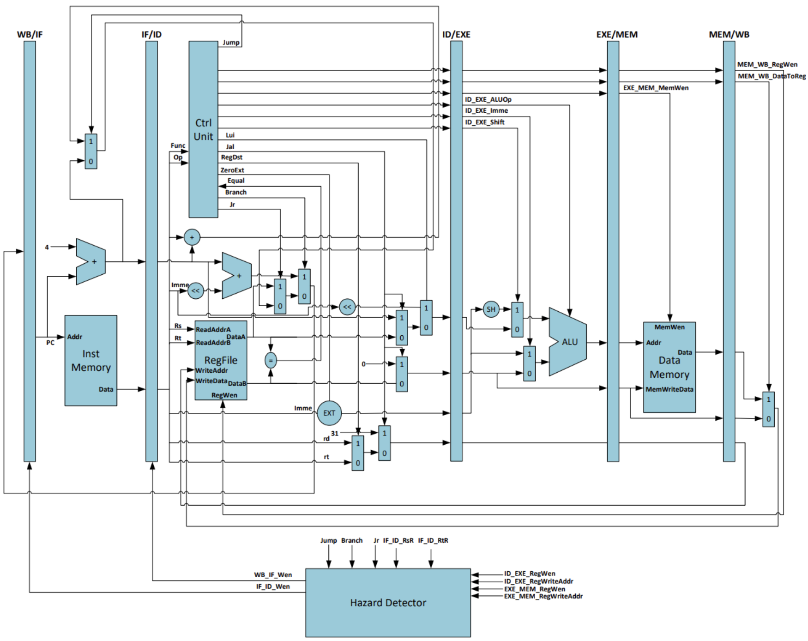

# Lab4-3

<!-- !!! danger "本实验并未 release，内容随时都会变化。个人水平有限，如您发现文档中的疏漏欢迎 Issue！" -->

!!! warning "在开始本实验之前，请备份Lab4-1与Lab4-2的所有工程，包括你使用的 IP Core。"
    你可以使用 git 保存之前的所有进度，并开新的分支来完成 Lab4-3。

在之前的实验中，我们完成了基本的指令，本节实验要在 Lab4-1 & Lab4-2 的基础之上拓展指令。

## 模块实现

!!! tip "在本节实验中，你需要实现以下指令："

    * R-Type: add, sub, and, or, xor, slt, srl, **sll**, **sra**, **sltu**
    * I-Type: addi, andi, ori, xori, slti, srli, **slli**, **srai**, **slti**, **sltiu**, **lb**, **lh**, lw, **lbu**, **lhu**, **jalr**
    * S-Type: **sb**, **sh**, sw
    * B-Type: beq, **bne**, **blt**, **bge**, **bltu**, **bgeu**
    * J-Type: jal
    * **U-Type**: **lui**, **auipc**

    即 [RISC-V 32I](../Other/RISC_V.md) 中除了 `ecall, ebreak` 外的所有指令，黑体标出的指令为新添加的指令。在开始实验之前，请保证你理解了所有的指令含义与类型。

你可以在 [venus](http://venus.cs61c.org/) 上使用以下代码来理解 `sb, sh` 的含义：

=== "sh"

    ```
    addi x11, x0, 0x421
    lui x10, 0x33333
    addi x10, x10, 0x333
    sw x10, 48(zero)
    sh x11, 49(zero)
    add zero, zero, zero
    ```
=== "sb"

    ```
    addi x11, x0, 0x22
    addi x10, x0, 0x20
    lui x9, 0x33333
    addi x9, x9, 0x333
    sw x9,48(zero)
    sb x11, 49(zero)
    sb x10, 50(zero)
    add zero, zero, zero
    ```

验收时，你需要提供自己绘制的 CPU 原理图，类似下图（下图仅为示意，并非本节实验的原理图）。建议在开始写代码之前绘制本图，梳理扩展指令时添加或修改的部件，明晰扩展指令的数据如何流动，控制信号应如何给。



你可以使用纸笔绘制（不推荐）但请保证验收时提供一张线条清晰较少涂改的原理图，也可以使用 Microsoft 的 Visio 或 PowerPoint、在线平台如 ProcessOn、 drawio 或平板软件绘制。

## 波形仿真

请修改上一节提供的 testbench，使之能够对指令扩展后的 SCPU 进行仿真验证。你可能需要将之前的 `wea` 信号从 1 位扩展为 4位/3位 以支持扩展指令中的 `unsigned, byte, half-word` 的要求。

同时，你需要自行编写一段简单的代码对所有指令进行测试。

## 下板验证

??? tip "验收代码"
    === "test_4_3.s" 

        ``` linenums="1" 
        auipc x26, 0x40
        auipc x27, 0x80
        srli x27, x27, 3
        slli x27, x27, 3
        srai x27, x27, 1
        bne x27, x26, dummy
        lui x26, 0x40000
        lui x27, 0x80000
        srai x27, x27, 1
        beq x27, x26, dummy

        # change your first digit in Studen ID to 3320'2233
        addi x24, zero, 0x22
        sb x24, 0x21(zero)
        addi x24, zero, 0x20
        sb x24, 0x22(zero)

        # change your second digit in Studen ID to 2204'2122
        addi x24, zero, 0x421
        sh x24, 0x25(zero)

        start:
        addi x1, zero, -1 # x1=FFFFFFFF
        lb x24, 0x18(zero) # x24=FFFFFFFF
        bne x1, x24, dummy
        lbu x24, 0x18(zero)# x24=000000FF
        bge x1, x24, dummy
        lh x24, 0x60(zero) # x24=FFFFF7E0
        blt zero, x24, dummy
        lhu x24, 0x60(zero) # x24=0000F7E0
        blt x24, zero, dummy
        xori x3, x1, 1 # x3=FFFFFFFE
        add x3, x3, x3 # x3=FFFFFFFC
        add x3, x3, x3 # x3=FFFFFFF8
        add x3, x3, x3 # x3=FFFFFFF0
        add x3, x3, x3 # x3=FFFFFFE0
        add x3, x3, x3 # x3=FFFFFFC0
        xor x20, x3, x1 # x20=0000003F
        add x3, x3, x3 # x3=FFFFFF80
        add x3, x3, x3 # x3=FFFFFF00
        add x3, x3, x3 # x3=FFFFFE00
        add x3, x3, x3 # x3=FFFFFC00
        add x3, x3, x3 # x3=FFFFF800
        add x3, x3, x3 # x3=FFFFF000
        add x3, x3, x3 # x3=FFFFE000
        add x3, x3, x3 # x3=FFFFC000
        add x3, x3, x3 # x3=FFFF8000
        add x3, x3, x3 # x3=FFFF0000
        add x3, x3, x3 # x3=FFFE0000
        add x3, x3, x3 # x3=FFFC0000
        add x3, x3, x3 # x3=FFF80000
        add x3, x3, x3 # x3=FFF00000
        add x3, x3, x3 # x3=FFE00000
        add x3, x3, x3 # x3=FFC00000
        add x3, x3, x3 # x3=FF800000
        add x3, x3, x3 # x3=FF000000
        add x3, x3, x3 # x3=FE000000
        add x3, x3, x3 # x3=FC000000
        add x6, x3, x3 # x6=F8000000
        add x3, x6, x6 # x3=F0000000
        add x4, x3, x3 # x4=E0000000
        add x13, x4, x4 # x13=C0000000
        lui x8, 0x80000 # x8=80000000
        ori x26, zero, 1 # x26=00000001
        andi x26, x26, 0xff # x26=00000001
        sra x30, x8, x26
        srl x27, x8, x26

        blt zero, zero, dummy
        blt x26, zero, dummy
        blt zero, x8, dummy

        bge zero, x26, dummy
        bge x8, zero, dummy

        bne x27, x30, loop

        dummy:
        add zero, zero, zero # 4
        add zero, zero, zero # 8
        add zero, zero, zero # C
        add zero, zero, zero # 10
        add zero, zero, zero # 14
        add zero, zero, zero # 18
        add zero, zero, zero # 1C
        jal zero, dummy

        loop:
        slt x2, x1, zero # x2=00000001 针对ALU32位有符号数减
        sltu x25, x1, zero # x25=00000000
        sltiu x29, x1, 0 # x29=00000000
        slti x2, x1, 0 # x2=00000001 针对ALU32位有符号数减
        add x14, x2, x2
        add x14, x14, x14 # x14=4
        sub x19, x14, x14 # x19=0
        srli x19, x19, 1
        addi x10, x19, -1
        or x10, x10, zero
        add x10, x10, x10 # x10=FFFFFFFE

        loop1:
        sw x6, 0x4(x3) # 计数器端口: F0000004, 送计数常数x6=F8000000
        lw x5, 0x0(x3) # 读GPIO端口F0000000状态: {counter0_out,counter1_out,counter2_out,led_out[12:0], SW}
        slli x5, x5, 2 # 左移2位将SW与LED对齐, 同时D1D0置00, 选择计数器通道0
        sw x5, 0x0(x3) # x5输出到GPIO端口F0000000, 设置计数器通道counter_set=00端口
        add x9, x9, x2 # x9=x9+1
        sw x9, 0x0(x4) # x9送x4=E0000000七段码端口
        lw x13, 0x14(zero) # 取存储器20单元预存数据至x13, 程序计数延时常数

        loop2:
        lw x5, 0x0(x3) # 读GPIO端口F0000000状态: {out0, out1, out2, D28-D20, LED7
        add x5, x5, x5
        add x5, x5, x5 # 左移2位将SW与LED对齐, 同时D1D0置00, 选择计数器通道0
        sw x5, 0x0(x3) # x5输出到GPIO端口F0000000, 计数器通道counter_set=00端口不变
        lw x5, 0x0(x3) # 再读GPIO端口F0000000状态
        and x11, x5, x8 # 取最高位=out0, 屏蔽其余位送x11
        add x13, x13, x2 # 程序计数延时
        beq x13, zero, C_init # 程序计数x13=0, 转计数器初始化, 修改7段码显示: C_init

        l_next: # 判断7段码显示模式：SW[4: 3]控制
        lw x5, 0x0(x3) # 再读GPIO端口F0000000开关SW状态
        add x18, x14, x14 # x14=4, x18=00000008
        add x22, x18, x18 # x22=00000010
        add x18, x18, x22 # x18=00000018(00011000)
        and x11, x5, x18 # 取SW[4: 3]
        beq x11, zero, L20 # SW[4: 3]=00, 7段显示"点"循环移位：L20, SW0=0
        beq x11, x18, L21 # SW[4: 3]=11, 显示七段图形, L21, SW0=0
        add x18, x14, x14 # x18=8
        beq x11, x18, L22 # SW[4: 3]=01, 七段显示预置数字, L22, SW0=1
        sw x9, 0x0(x4) # SW[4: 3]=10, 显示x9, SW0=1
        bltu zero, x4, loop2

        L20:
        beq x10, x1, L4 # x10=ffffffff, 转移L4\\
        bgeu x4, zero, L3

        L4:
        addi x10, zero, -1 # x10=ffffffff
        add x10, x10, x10 # x10=fffffffe

        L3:
        sw x10, 0x0(x4) # SW[4: 3]=00, 7段显示点移位后显示
        jal zero, loop2

        L21:
        lw x9, 0x60(x17) # SW[4: 3]=11, 从内存取预存七段图形
        sw x9, 0x0(x4) # SW[4: 3]=11, 显示七段图形
        addi x31, zero, 0x150
        jalr zero, x31, 0x24 #jump to pc 0x174

        L22:
        lw x9, 0x20(x17) # SW[4: 3]=01, 从内存取预存数字
        sw x9, 0x0(x4) # SW[4: 3]=01, 七段显示预置数字
        blt x4, zero, loop2

        C_init:
        lw x13, 0x14(zero) # 取程序计数延时初始化常数
        add x10, x10, x10 # x10=fffffffc, 7段图形点左移121 or x10, x10, x2 # x10末位置1, 对应右上角不显示
        add x17, x17, x14 # x17=00000004, LED图形访存地址+4
        and x17, x17, x20 # x17=000000XX, 屏蔽地址高位, 只取6位
        add x9, x9, x2 # x9+1
        beq x9, x1, L6 # 若x9=ffffffff, 重置x9=5
        bge zero, zero, L7

        L6:
        add x9, zero, x14 # x9=4
        add x9, x9, x2 # 重置x9=5

        L7:
        lw x5, 0x0(x3) # 读GPIO端口F0000000状态
        add x11, x5, x5
        slli x11, x11, 1 # 左移2位将SW与LED对齐, 同时D1D0置00, 选择计数器通道0
        sw x11, 0x0(x3) # x5输出到GPIO端口F0000000, 计数器通道counter_set=00端口不变
        sw x6, 0x4(x3) # 计数器端口: F0000004, 送计数常数x6=F8000000
        bge zero, x4, l_next
        ```

    === "IMem_4_3.coe"

        ```
        memory_initialization_radix=16;
        memory_initialization_vector=
        00040D17, 00080D97, 003DDD93, 003D9D93, 401DDD93, 0FAD9C63, 
        40000D37, 80000DB7, 401DDD93, 0FAD8463, 02200C13, 038000A3, 
        02000C13, 03800123, 42100C13, 038012A3, FFF00093, 01800C03, 
        0D809263, 01804C03, 0B80DE63, 06001C03, 0B804A63, 06005C03, 
        0A0C4663, 0010C193, 003181B3, 003181B3, 003181B3, 003181B3, 
        003181B3, 0011CA33, 003181B3, 003181B3, 003181B3, 003181B3, 
        003181B3, 003181B3, 003181B3, 003181B3, 003181B3, 003181B3, 
        003181B3, 003181B3, 003181B3, 003181B3, 003181B3, 003181B3, 
        003181B3, 003181B3, 003181B3, 003181B3, 00318333, 006301B3, 
        00318233, 004206B3, 80000437, 00106D13, 0FFD7D13, 41A45F33, 
        01A45DB3, 00004C63, 000D4A63, 00804863, 01A05663, 00045463, 
        03ED9263, 00000033, 00000033, 00000033, 00000033, 00000033, 
        00000033, 00000033, FE5FF06F, 0000A133, 0000BCB3, 0000BE93, 
        0000A113, 00210733, 00E70733, 40E709B3, 0019D993, FFF98513, 
        00056533, 00A50533, 0061A223, 0001A283, 00229293, 0051A023, 
        002484B3, 00922023, 01402683, 0001A283, 005282B3, 005282B3, 
        0051A023, 0001A283, 0082F5B3, 002686B3, 06068263, 0001A283, 
        00E70933, 01290B33, 01690933, 0122F5B3, 00058C63, 03258663, 
        00E70933, 03258A63, 00922023, FA406CE3, 00150463, 00027663, 
        FFF00513, 00A50533, 00A22023, FA1FF06F, 0608A483, 00922023, 
        15000F93, 024F8067, 0208A483, 00922023, F80242E3, 01402683, 
        00A50533, 00E888B3, 0148F8B3, 002484B3, 00148463, 00005663, 
        00E004B3, 002484B3, 0001A283, 005285B3, 00159593, 00B1A023, 
        0061A223, F64054E3;
        ```

    === "DMem.coe"

        ```
        memory_initialization_radix=16;
        memory_initialization_vector=
        f0000000, 000002AB, 80000000, 0000003F, 00000001, FFF70000, 0000FFFF, 80000000, 00000000, 11111111, 
        22222222, 33333333, 44444444, 55555555, 66666666, 77777777, 88888888, 99999999, aaaaaaaa, bbbbbbbb, 
        cccccccc, dddddddd, eeeeeeee, ffffffff, 557EF7E0, D7BDFBD9, D7DBFDB9, DFCFFCFB, DFCFBFFF, F7F3DFFF,
        FFFFDF3D, FFFF9DB9, FFFFBCFB, DFCFFCFB, DFCFBFFF, D7DB9FFF, D7DBFDB9, D7BDFBD9, FFFF07E0, 007E0FFF,
        03bdf020, 03def820, 08002300;
        ```

使用验收代码的预期表现与上一节基本相同，唯一变化是显示学号时，前两位(32)的显示将被改变。