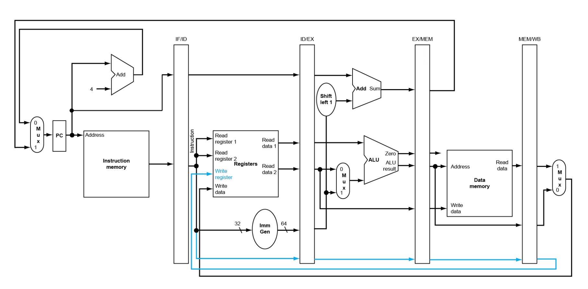

# 基础流水线

## 模块实现

本实验需要实现一个五阶段流水线 CPU，流水线的五个阶段分别是：取指（IF）、译码（ID）、执行（EX）、访存（MEM）、写回（WB），不需要处理冲突。（假设本实验的仿真和验收代码均不存在数据冲突和控制冲突的情况）

* 你需要基于 Lab4-3 的代码进行修改。
* 和 Lab4-3 类似地，验收时，你需要提供自己绘制的 CPU datapath 图。（笔者建议在开始本次实验之前就开始绘制，以便更好地理解流水线 CPU 的数据流）你可以参考理论课 PPT 的 datapath 或者其他人的图，但每个人的实现不尽相同，请务必动手绘制属于自己的 datapath。这里以理论课 PPT 的 datapath 为例：

    

* 流水线的验证较为繁琐，良好的仿真测试可以事半功倍。请做好仿真验证，让仿真代码尽量覆盖所有情况。

!!! Tip
    * 你可能需要改变某些指令的数值，这些指令与 PC 值有关（如 `AUIPC` 和 `JALR` 等）。
    * 流水线寄存器是本次实验的一大重点，在进行实验之前，思考并梳理有哪些值是需要传到下一个阶段的。流水线寄存器部分代码较多，且大部分均为类似代码。为了书写方便，减少出错，笔者建议统一模块、寄存器、变量的命名方式，同时可以利用文本批量替换、Copilot 等工具来加速编写。

## 仿真验证

TODO

## 下板验证

验收时，你需要使用以下验收代码。IMem.coe、DMem.coe 的内容和格式与 Lab4-3 相同。使用验收代码的预期表现与 Lab4-3 的结果基本相同。区别在于在本次实验中，因为我们在每两条指令之间插入了 3 条 `add zero, zero, zero` 指令，因此观察到的现象与之前相比会慢若干倍。

??? tip "验收代码"
    ``` linenums="1" 
    auipc x26, 0x40
    add zero, zero, zero
    add zero, zero, zero
    add zero, zero, zero
    auipc x27, 0x80
    add zero, zero, zero
    add zero, zero, zero
    add zero, zero, zero
    srli x27, x27, 5
    add zero, zero, zero
    add zero, zero, zero
    add zero, zero, zero
    slli x27, x27, 5
    add zero, zero, zero
    add zero, zero, zero
    add zero, zero, zero
    srai x27, x27, 1
    add zero, zero, zero
    add zero, zero, zero
    add zero, zero, zero
    bne x27, x26, dummy
    add zero, zero, zero
    add zero, zero, zero
    add zero, zero, zero
    lui x26, 0x40000
    add zero, zero, zero
    add zero, zero, zero
    add zero, zero, zero
    lui x27, 0x80000
    add zero, zero, zero
    add zero, zero, zero
    add zero, zero, zero
    srai x27, x27, 1
    add zero, zero, zero
    add zero, zero, zero
    add zero, zero, zero
    beq x27, x26, dummy
    add zero, zero, zero
    add zero, zero, zero
    add zero, zero, zero

    # change your first digit in Studen ID to 3320'2233
    addi x24, zero, 0x22
    add zero, zero, zero
    add zero, zero, zero
    add zero, zero, zero
    sb x24, 0x21(zero)
    add zero, zero, zero
    add zero, zero, zero
    add zero, zero, zero
    addi x24, zero, 0x20
    add zero, zero, zero
    add zero, zero, zero
    add zero, zero, zero
    sb x24, 0x22(zero)
    add zero, zero, zero
    add zero, zero, zero
    add zero, zero, zero

    # change your second digit in Studen ID to 2204'2122
    addi x24, zero, 0x421
    add zero, zero, zero
    add zero, zero, zero
    add zero, zero, zero
    sh x24, 0x25(zero)
    add zero, zero, zero
    add zero, zero, zero
    add zero, zero, zero

    start:
    addi x1, zero, -1 # x1=FFFFFFFF
    add zero, zero, zero
    add zero, zero, zero
    add zero, zero, zero
    lb x24, 0x18(zero) # x24=FFFFFFFF
    add zero, zero, zero
    add zero, zero, zero
    add zero, zero, zero
    bne x1, x24, dummy
    add zero, zero, zero
    add zero, zero, zero
    add zero, zero, zero
    lbu x24, 0x18(zero)# x24=000000FF
    add zero, zero, zero
    add zero, zero, zero
    add zero, zero, zero
    bge x1, x24, dummy
    add zero, zero, zero
    add zero, zero, zero
    add zero, zero, zero
    lh x24, 0x60(zero) # x24=FFFFF7E0
    add zero, zero, zero
    add zero, zero, zero
    add zero, zero, zero
    blt zero, x24, dummy
    add zero, zero, zero
    add zero, zero, zero
    add zero, zero, zero
    lhu x24, 0x60(zero) # x24=0000F7E0
    add zero, zero, zero
    add zero, zero, zero
    add zero, zero, zero
    blt x24, zero, dummy
    add zero, zero, zero
    add zero, zero, zero
    add zero, zero, zero
    xori x3, x1, 1 # x3=FFFFFFFE
    add zero, zero, zero
    add zero, zero, zero
    add zero, zero, zero
    add x3, x3, x3 # x3=FFFFFFFC
    add zero, zero, zero
    add zero, zero, zero
    add zero, zero, zero
    add x3, x3, x3 # x3=FFFFFFF8
    add zero, zero, zero
    add zero, zero, zero
    add zero, zero, zero
    add x3, x3, x3 # x3=FFFFFFF0
    add zero, zero, zero
    add zero, zero, zero
    add zero, zero, zero
    add x3, x3, x3 # x3=FFFFFFE0
    add zero, zero, zero
    add zero, zero, zero
    add zero, zero, zero
    add x3, x3, x3 # x3=FFFFFFC0
    add zero, zero, zero
    add zero, zero, zero
    add zero, zero, zero
    xor x20, x3, x1 # x20=0000003F
    add zero, zero, zero
    add zero, zero, zero
    add zero, zero, zero
    add x3, x3, x3 # x3=FFFFFF80
    add zero, zero, zero
    add zero, zero, zero
    add zero, zero, zero
    add x3, x3, x3 # x3=FFFFFF00
    add zero, zero, zero
    add zero, zero, zero
    add zero, zero, zero
    add x3, x3, x3 # x3=FFFFFE00
    add zero, zero, zero
    add zero, zero, zero
    add zero, zero, zero
    add x3, x3, x3 # x3=FFFFFC00
    add zero, zero, zero
    add zero, zero, zero
    add zero, zero, zero
    add x3, x3, x3 # x3=FFFFF800
    add zero, zero, zero
    add zero, zero, zero
    add zero, zero, zero
    add x3, x3, x3 # x3=FFFFF000
    add zero, zero, zero
    add zero, zero, zero
    add zero, zero, zero
    add x3, x3, x3 # x3=FFFFE000
    add zero, zero, zero
    add zero, zero, zero
    add zero, zero, zero
    add x3, x3, x3 # x3=FFFFC000
    add zero, zero, zero
    add zero, zero, zero
    add zero, zero, zero
    add x3, x3, x3 # x3=FFFF8000
    add zero, zero, zero
    add zero, zero, zero
    add zero, zero, zero
    add x3, x3, x3 # x3=FFFF0000
    add zero, zero, zero
    add zero, zero, zero
    add zero, zero, zero
    add x3, x3, x3 # x3=FFFE0000
    add zero, zero, zero
    add zero, zero, zero
    add zero, zero, zero
    add x3, x3, x3 # x3=FFFC0000
    add zero, zero, zero
    add zero, zero, zero
    add zero, zero, zero
    add x3, x3, x3 # x3=FFF80000
    add zero, zero, zero
    add zero, zero, zero
    add zero, zero, zero
    add x3, x3, x3 # x3=FFF00000
    add zero, zero, zero
    add zero, zero, zero
    add zero, zero, zero
    add x3, x3, x3 # x3=FFE00000
    add zero, zero, zero
    add zero, zero, zero
    add zero, zero, zero
    add x3, x3, x3 # x3=FFC00000
    add zero, zero, zero
    add zero, zero, zero
    add zero, zero, zero
    add x3, x3, x3 # x3=FF800000
    add zero, zero, zero
    add zero, zero, zero
    add zero, zero, zero
    add x3, x3, x3 # x3=FF000000
    add zero, zero, zero
    add zero, zero, zero
    add zero, zero, zero
    add x3, x3, x3 # x3=FE000000
    add zero, zero, zero
    add zero, zero, zero
    add zero, zero, zero
    add x3, x3, x3 # x3=FC000000
    add zero, zero, zero
    add zero, zero, zero
    add zero, zero, zero
    add x6, x3, x3 # x6=F8000000
    add zero, zero, zero
    add zero, zero, zero
    add zero, zero, zero
    add x3, x6, x6 # x3=F0000000
    add zero, zero, zero
    add zero, zero, zero
    add zero, zero, zero
    add x4, x3, x3 # x4=E0000000
    add zero, zero, zero
    add zero, zero, zero
    add zero, zero, zero
    add x13, x4, x4 # x13=C0000000
    add zero, zero, zero
    add zero, zero, zero
    add zero, zero, zero
    lui x8, 0x80000 # x8=80000000
    add zero, zero, zero
    add zero, zero, zero
    add zero, zero, zero
    ori x26, zero, 1 # x26=00000001
    add zero, zero, zero
    add zero, zero, zero
    add zero, zero, zero
    andi x26, x26, 0xff # x26=00000001
    add zero, zero, zero
    add zero, zero, zero
    add zero, zero, zero
    sra x30, x8, x26
    add zero, zero, zero
    add zero, zero, zero
    add zero, zero, zero
    srl x27, x8, x26
    add zero, zero, zero
    add zero, zero, zero
    add zero, zero, zero

    blt zero, zero, dummy
    add zero, zero, zero
    add zero, zero, zero
    add zero, zero, zero
    blt x26, zero, dummy
    add zero, zero, zero
    add zero, zero, zero
    add zero, zero, zero
    blt zero, x8, dummy
    add zero, zero, zero
    add zero, zero, zero
    add zero, zero, zero

    bge zero, x26, dummy
    add zero, zero, zero
    add zero, zero, zero
    add zero, zero, zero
    bge x8, zero, dummy
    add zero, zero, zero
    add zero, zero, zero
    add zero, zero, zero

    bne x27, x30, loop
    add zero, zero, zero
    add zero, zero, zero
    add zero, zero, zero

    dummy:
    add zero, zero, zero # 4
    add zero, zero, zero
    add zero, zero, zero
    add zero, zero, zero
    add zero, zero, zero # 8
    add zero, zero, zero
    add zero, zero, zero
    add zero, zero, zero
    add zero, zero, zero # C
    add zero, zero, zero
    add zero, zero, zero
    add zero, zero, zero
    add zero, zero, zero # 10
    add zero, zero, zero
    add zero, zero, zero
    add zero, zero, zero
    add zero, zero, zero # 14
    add zero, zero, zero
    add zero, zero, zero
    add zero, zero, zero
    add zero, zero, zero # 18
    add zero, zero, zero
    add zero, zero, zero
    add zero, zero, zero
    add zero, zero, zero # 1C
    add zero, zero, zero
    add zero, zero, zero
    add zero, zero, zero
    jal zero, dummy
    add zero, zero, zero
    add zero, zero, zero
    add zero, zero, zero

    loop:
    slt x2, x1, zero # x2=00000001 针对ALU32位有符号数减
    add zero, zero, zero
    add zero, zero, zero
    add zero, zero, zero
    sltu x25, x1, zero # x25=00000000
    add zero, zero, zero
    add zero, zero, zero
    add zero, zero, zero
    sltiu x29, x1, 0 # x29=00000000
    add zero, zero, zero
    add zero, zero, zero
    add zero, zero, zero
    slti x2, x1, 0 # x2=00000001 针对ALU32位有符号数减
    add zero, zero, zero
    add zero, zero, zero
    add zero, zero, zero
    add x14, x2, x2
    add zero, zero, zero
    add zero, zero, zero
    add zero, zero, zero
    add x14, x14, x14 # x14=4
    add zero, zero, zero
    add zero, zero, zero
    add zero, zero, zero
    sub x19, x14, x14 # x19=0
    add zero, zero, zero
    add zero, zero, zero
    add zero, zero, zero
    srli x19, x19, 1
    add zero, zero, zero
    add zero, zero, zero
    add zero, zero, zero
    addi x10, x19, -1
    add zero, zero, zero
    add zero, zero, zero
    add zero, zero, zero
    or x10, x10, zero
    add zero, zero, zero
    add zero, zero, zero
    add zero, zero, zero
    add x10, x10, x10 # x10=FFFFFFFE
    add zero, zero, zero
    add zero, zero, zero
    add zero, zero, zero

    loop1:
    sw x6, 0x4(x3) # 计数器端口: F0000004, 送计数常数x6=F8000000
    add zero, zero, zero
    add zero, zero, zero
    add zero, zero, zero
    lw x5, 0x0(x3) # 读GPIO端口F0000000状态: {counter0_out,counter1_out,counter2_out,led_out[12:0], SW}
    add zero, zero, zero
    add zero, zero, zero
    add zero, zero, zero
    sll x5, x5, x23 # 左移2位将SW与LED对齐, 同时D1D0置00, 选择计数器通道0
    add zero, zero, zero
    add zero, zero, zero
    add zero, zero, zero
    sw x5, 0x0(x3) # x5输出到GPIO端口F0000000, 设置计数器通道counter_set=00端口
    add zero, zero, zero
    add zero, zero, zero
    add zero, zero, zero
    add x9, x9, x2 # x9=x9+1
    add zero, zero, zero
    add zero, zero, zero
    add zero, zero, zero
    sw x9, 0x0(x4) # x9送x4=E0000000七段码端口
    add zero, zero, zero
    add zero, zero, zero
    add zero, zero, zero
    lw x13, 0x14(zero) # 取存储器20单元预存数据至x13, 程序计数延时常数
    add zero, zero, zero
    add zero, zero, zero
    add zero, zero, zero

    loop2:
    lw x5, 0x0(x3) # 读GPIO端口F0000000状态: {out0, out1, out2, D28-D20, LED7
    add zero, zero, zero
    add zero, zero, zero
    add zero, zero, zero
    add x5, x5, x5
    add zero, zero, zero
    add zero, zero, zero
    add zero, zero, zero
    add x5, x5, x5 # 左移2位将SW与LED对齐, 同时D1D0置00, 选择计数器通道0
    add zero, zero, zero
    add zero, zero, zero
    add zero, zero, zero
    sw x5, 0x0(x3) # x5输出到GPIO端口F0000000, 计数器通道counter_set=00端口不变
    add zero, zero, zero
    add zero, zero, zero
    add zero, zero, zero
    lw x5, 0x0(x3) # 再读GPIO端口F0000000状态
    add zero, zero, zero
    add zero, zero, zero
    add zero, zero, zero
    and x11, x5, x8 # 取最高位=out0, 屏蔽其余位送x11
    add zero, zero, zero
    add zero, zero, zero
    add zero, zero, zero
    add x13, x13, x2 # 程序计数延时
    add zero, zero, zero
    add zero, zero, zero
    add zero, zero, zero
    beq x13, zero, C_init # 程序计数x13=0, 转计数器初始化, 修改7段码显示: C_init
    add zero, zero, zero
    add zero, zero, zero
    add zero, zero, zero

    l_next: # 判断7段码显示模式：SW[4: 3]控制
    add zero, zero, zero
    add zero, zero, zero
    add zero, zero, zero
    lw x5, 0x0(x3) # 再读GPIO端口F0000000开关SW状态
    add zero, zero, zero
    add zero, zero, zero
    add zero, zero, zero
    add x18, x14, x14 # x14=4, x18=00000008
    add zero, zero, zero
    add zero, zero, zero
    add zero, zero, zero
    add x22, x18, x18 # x22=00000010
    add zero, zero, zero
    add zero, zero, zero
    add zero, zero, zero
    add x18, x18, x22 # x18=00000018(00011000)
    add zero, zero, zero
    add zero, zero, zero
    add zero, zero, zero
    and x11, x5, x18 # 取SW[4: 3]
    add zero, zero, zero
    add zero, zero, zero
    add zero, zero, zero
    beq x11, zero, L20 # SW[4: 3]=00, 7段显示"点"循环移位：L20, SW0=0
    add zero, zero, zero
    add zero, zero, zero
    add zero, zero, zero
    beq x11, x18, L21 # SW[4: 3]=11, 显示七段图形, L21, SW0=0
    add zero, zero, zero
    add zero, zero, zero
    add zero, zero, zero
    add x18, x14, x14 # x18=8
    add zero, zero, zero
    add zero, zero, zero
    add zero, zero, zero
    beq x11, x18, L22 # SW[4: 3]=01, 七段显示预置数字, L22, SW0=1
    add zero, zero, zero
    add zero, zero, zero
    add zero, zero, zero
    sw x9, 0x0(x4) # SW[4: 3]=10, 显示x9, SW0=1
    add zero, zero, zero
    add zero, zero, zero
    add zero, zero, zero
    bltu zero, x4, loop2
    add zero, zero, zero
    add zero, zero, zero
    add zero, zero, zero

    L20:
    beq x10, x1, L4 # x10=ffffffff, 转移L4
    add zero, zero, zero
    add zero, zero, zero
    add zero, zero, zero
    bgeu x4, zero, L3
    add zero, zero, zero
    add zero, zero, zero
    add zero, zero, zero

    L4:
    addi x10, zero, -1 # x10=ffffffff
    add zero, zero, zero
    add zero, zero, zero
    add zero, zero, zero
    add x10, x10, x10 # x10=fffffffe
    add zero, zero, zero
    add zero, zero, zero
    add zero, zero, zero

    L3:
    sw x10, 0x0(x4) # SW[4: 3]=00, 7段显示点移位后显示
    add zero, zero, zero
    add zero, zero, zero
    add zero, zero, zero
    jal zero, loop2
    add zero, zero, zero
    add zero, zero, zero
    add zero, zero, zero

    L21:
    lw x9, 0x60(x17) # SW[4: 3]=11, 从内存取预存七段图形
    add zero, zero, zero
    add zero, zero, zero
    add zero, zero, zero
    sw x9, 0x0(x4) # SW[4: 3]=11, 显示七段图形
    add zero, zero, zero
    add zero, zero, zero
    add zero, zero, zero
    addi x31, zero, 0x500
    add zero, zero, zero
    add zero, zero, zero
    add zero, zero, zero
    jalr zero, x31, 0xd0 #jump to pc 0x5d0
    add zero, zero, zero
    add zero, zero, zero
    add zero, zero, zero

    L22:
    lw x9, 0x20(x17) # SW[4: 3]=01, 从内存取预存数字
    add zero, zero, zero
    add zero, zero, zero
    add zero, zero, zero
    sw x9, 0x0(x4) # SW[4: 3]=01, 七段显示预置数字
    add zero, zero, zero
    add zero, zero, zero
    add zero, zero, zero
    blt x4, zero, loop2
    add zero, zero, zero
    add zero, zero, zero
    add zero, zero, zero

    C_init:
    lw x13, 0x14(zero) # 取程序计数延时初始化常数
    add zero, zero, zero
    add zero, zero, zero
    add zero, zero, zero
    add x10, x10, x10 # x10=fffffffc, 7段图形点左移121 or x10, x10, x2 # x10末位置1, 对应右上角不显示
    add zero, zero, zero
    add zero, zero, zero
    add zero, zero, zero
    add x17, x17, x14 # x17=00000004, LED图形访存地址+4
    add zero, zero, zero
    add zero, zero, zero
    add zero, zero, zero
    and x17, x17, x20 # x17=000000XX, 屏蔽地址高位, 只取6位
    add zero, zero, zero
    add zero, zero, zero
    add zero, zero, zero
    add x9, x9, x2 # x9+1
    add zero, zero, zero
    add zero, zero, zero
    add zero, zero, zero
    beq x9, x1, L6 # 若x9=ffffffff, 重置x9=5
    add zero, zero, zero
    add zero, zero, zero
    add zero, zero, zero
    bge zero, zero, L7
    add zero, zero, zero
    add zero, zero, zero
    add zero, zero, zero

    L6:
    add x9, zero, x14 # x9=4
    add zero, zero, zero
    add zero, zero, zero
    add zero, zero, zero
    add x9, x9, x2 # 重置x9=5
    add zero, zero, zero
    add zero, zero, zero
    add zero, zero, zero

    L7:
    lw x5, 0x0(x3) # 读GPIO端口F0000000状态
    add zero, zero, zero
    add zero, zero, zero
    add zero, zero, zero
    add x11, x5, x5
    add zero, zero, zero
    add zero, zero, zero
    add zero, zero, zero
    slli x11, x11, 1 # 左移2位将SW与LED对齐, 同时D1D0置00, 选择计数器通道0
    add zero, zero, zero
    add zero, zero, zero
    add zero, zero, zero
    sw x11, 0x0(x3) # x5输出到GPIO端口F0000000, 计数器通道counter_set=00端口不变
    add zero, zero, zero
    add zero, zero, zero
    add zero, zero, zero
    sw x6, 0x4(x3) # 计数器端口: F0000004, 送计数常数x6=F8000000
    add zero, zero, zero
    add zero, zero, zero
    add zero, zero, zero
    bge zero, x4, l_next
    add zero, zero, zero
    add zero, zero, zero
    add zero, zero, zero
    ```

## 实验要求

本次实验你需要完成的内容有：

* 绘制自己的 CPU datapath 图。
* 根据自己的 datapath 完成不处理冲突的五阶段流水线 CPU。
* 对实现的 CPU 进行仿真验证、下板验证、验收。
* 实验报告里需要包含的内容：
    * datapath 图。
    * 流水线 CPU 代码（重点部分结合 datapath 和 Verilog 代码解释）
    * 仿真代码与波形截图（注意缩放比例、数制选择合适），并分析仿真波形。
    * 下板图片与现象描述。
